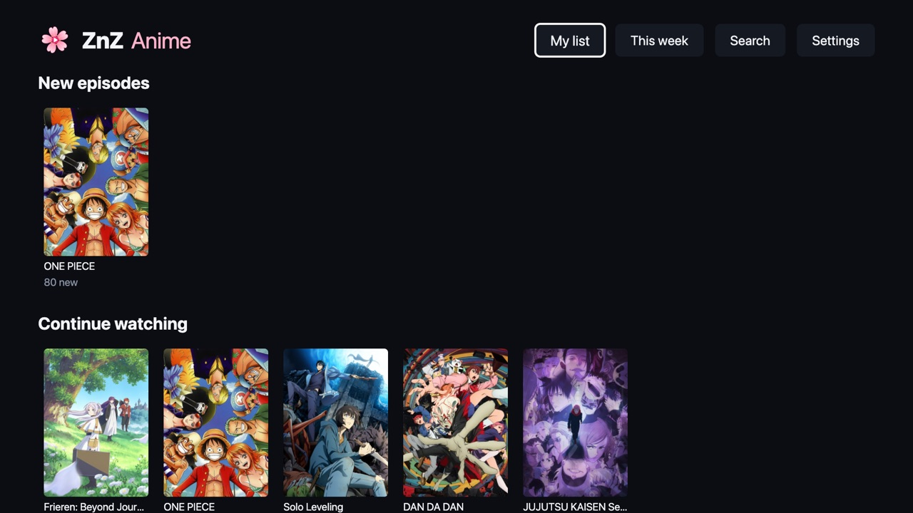
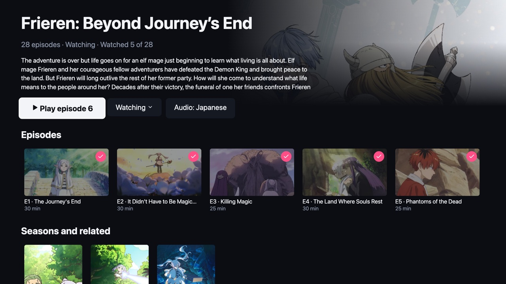
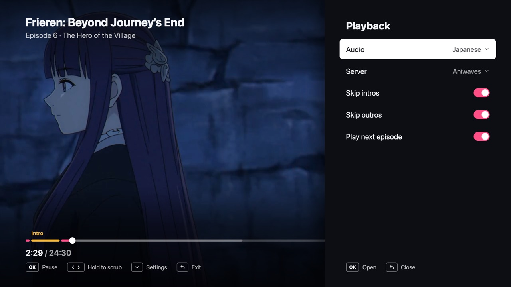
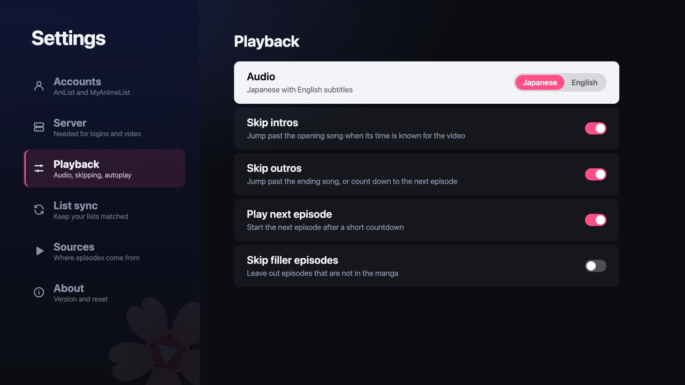
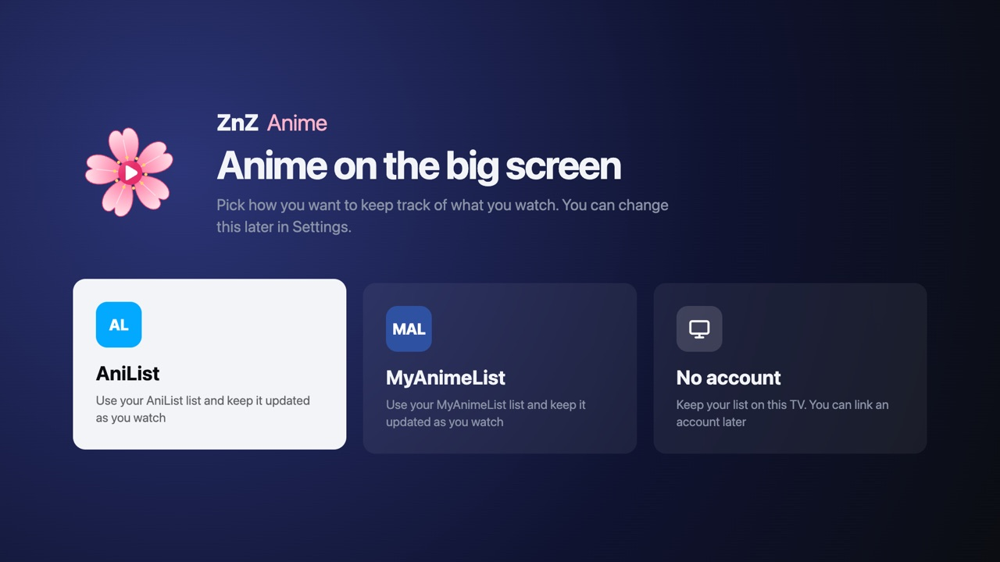

<p align="center">
  
</p>

<h1 align="center">ZnZ Anime</h1>

<p align="center">An anime app for Samsung smart TVs (Tizen), made to be used with the TV remote only.</p>

<p align="center">
  <a href="https://github.com/zaimimr/ZnZ-Anime/releases/latest"></a>
  <a href="LICENSE"></a>
</p>



- Browse trending shows, this season, recommendations and search
- Play episodes with intro and outro skipping, scrub previews, subtitles, sub or dub, and autoplay of the next episode
- Keep track with AniList, MyAnimeList, both or neither. Without an account your list is saved on the TV
- New episodes row, a weekly airing schedule and filler badges

Tested on a Samsung The Frame (Tizen 6+) at 1920x1080.

| | |
|---|---|
|  |  |
|  |  |

## Install on your TV

You need a computer on the same network as the TV and about 30 minutes. Want help? Give [INSTALL_WITH_AI.md](INSTALL_WITH_AI.md) to an AI coding assistant (Claude Code, Codex, Cursor and so on) and it walks you through every step.

### 1. Put the TV in Developer Mode

1. Press the **Home** button on the remote and go to **Apps**.
2. Scroll all the way down to **App Settings** and open it.
3. Type `1` `2` `3` `4` `5`. If the remote has no number keys, press the **123** (or colored) button to bring up the on-screen keypad first.
4. In the pop-up, switch **Developer Mode** to **On**.
5. Enter the IP address of your computer (it must be on the same network) and select **OK**.
6. Restart the TV: turn it off and back on, or hold the power button until it restarts.

### 2. Set up your server

The app needs a small server to play videos (streaming sites only answer requests with the right headers, which the TV cannot send) and to log in with AniList or MyAnimeList. It runs free on your own Cloudflare account.

1. Make a free account at [cloudflare.com](https://dash.cloudflare.com/sign-up) and install [Node.js](https://nodejs.org) 22 or newer and [pnpm](https://pnpm.io/installation).
2. Get the code and deploy:

   ```bash
   git clone https://github.com/zaimimr/ZnZ-Anime.git
   cd ZnZ-Anime && pnpm install
   cd worker
   npx wrangler login
   npx wrangler kv namespace create PAIRS
   ```

3. Copy the `id` it prints into `worker/wrangler.jsonc` in place of the one there, then run `npx wrangler deploy`. Note the address it prints, like `https://znz-auth.<you>.workers.dev`.

Videos work now. For logins, also do the optional steps below.

**AniList login (optional):** create a client at https://anilist.co/settings/developer with redirect URL `https://znz-auth.<you>.workers.dev/callback/anilist`, then `npx wrangler secret put ANILIST_CLIENT_ID`.

**MyAnimeList login (optional):** create an app at https://myanimelist.net/apiconfig (type **web**) with redirect URL `https://znz-auth.<you>.workers.dev/callback/mal`, then `npx wrangler secret put MAL_CLIENT_ID` and `npx wrangler secret put MAL_CLIENT_SECRET`.

### 3. Install Tizen Studio and make a certificate

Samsung only lets you install your own apps with a certificate made for your TV, so you sign the app yourself once.

1. Install [Tizen Studio](https://developer.tizen.org/development/tizen-studio/download) (the CLI version is enough).
2. In the Tizen Studio **Package Manager**, open **Extension SDK** and install **Samsung Certificate Extension**.
3. Connect to the TV: `~/tizen-studio/tools/sdb connect <tv-ip>`
4. Open **Certificate Manager**, create a new **Samsung** certificate profile, log in with a Samsung account and choose **TV** as the device type. The TV you connected is added to the certificate. Remember the profile name.

### 4. Install the app

1. Download `ZnZAnime-<version>.zip` from the [latest release](https://github.com/zaimimr/ZnZ-Anime/releases/latest) and unzip it into a folder called `ZnZAnime`.
2. Sign and install it:

   ```bash
   TIZEN=~/tizen-studio/tools/ide/bin/tizen
   $TIZEN package -t wgt -s <your-profile> -- ZnZAnime
   $TIZEN install -n ZnZAnime/*.wgt -t $(~/tizen-studio/tools/sdb devices | awk 'NR==2 {print $3}')
   ```

3. Open ZnZ Anime from **Apps**, go to **Settings > Server** and type your server address (without `https://`).

To update, download the new release and repeat step 4. Your list, settings and server are kept.

## Using the app

On first start, pick **AniList**, **MyAnimeList** or **No account**. You can change this any time in **Settings > Accounts**.

- **Logging in**: scan the QR code on the TV with your phone, log in, and the TV moves on by itself.
- **Both accounts**: AniList is the main list and every change also goes to MAL. Turn this off, or merge the two lists once, in **Settings > List sync**.
- **No account**: the list lives on the TV. If you link an account later, **Settings > List sync** can copy it over.
- **Sources**: if a source site moves or is blocked, open **Settings > Sources**, choose it and change its address to a mirror (for Miruro, for example `www.miruro.tv`). The app checks the address before saving it.
- **Remote**: arrows to move, OK to choose, Back to go back. In the player, hold left or right to scrub, press down for playback settings.

Intro and outro times come from [AniSkip](https://aniskip.com). They are skipped automatically only when they match the exact video that is playing. Otherwise the app shows a **Skip** button instead.

## Build from source

```bash
pnpm install
pnpm test
cp app/.env.example app/.env.local   # set VITE_AUTH_URL to your server
pnpm dev                              # open http://localhost:5173 at 1920x1080, use arrow keys, Enter and Escape
pnpm check:sources                    # checks each streaming source against the live site
TIZEN_PROFILE=<your-profile> pnpm --filter app package:tv   # builds and signs app/dist/ZnZAnime.wgt
```

### Parts

- `app/`: the TV app (Vite, React, TypeScript)
- `worker/`: the server, a Cloudflare Worker for QR login, MAL token refresh and a stream proxy for sources that need a Referer header

### Built-in server

Instead of typing the address on the TV, you can build it in: put `VITE_AUTH_URL=https://znz-auth.<you>.workers.dev` in `app/.env.production.local` before `pnpm --filter app package:tv`. **Settings > Server** still overrides it.

### Add a source

Create `app/src/sources/<name>/index.ts` that implements `SourceAdapter` from `app/src/sources/types.ts`: a `name`, a `defaultHost`, a `check(host)` that tells whether an address serves that source, and `resolve`, `episodes` and `stream`. Read the address with `sourceHost()` from `app/src/sources/host.ts` so people can point it at a mirror. Register it in `app/src/sources/registry.ts` and run `pnpm check:sources`.

### Release

Push a tag like `v1.0.0`. GitHub Actions runs the tests, builds the app and attaches `ZnZAnime-v1.0.0.zip` to a new release.

## License

MIT, see [LICENSE](LICENSE).

## Disclaimer

ZnZ Anime does not host any video. It plays streams that third-party sites make public, and the app works only as long as those sites do. Check that streaming this content is legal where you live.
