# Picture guide: install ZnZ Anime on a Samsung TV

Follow the pictures from top to bottom. It takes about 30 minutes the first time. Keep the TV and the computer on the same Wi-Fi or network the whole time.

The TV pictures are drawings. Menus on your TV can look a little different depending on the model and year, but the names are the same.

Stuck? Give [INSTALL_WITH_AI.md](../INSTALL_WITH_AI.md) to an AI assistant and it can run the computer steps for you.

---

## Part 1: On the TV

### 1. Open Apps

Press **Home** on the remote, move to **Apps** and press OK.

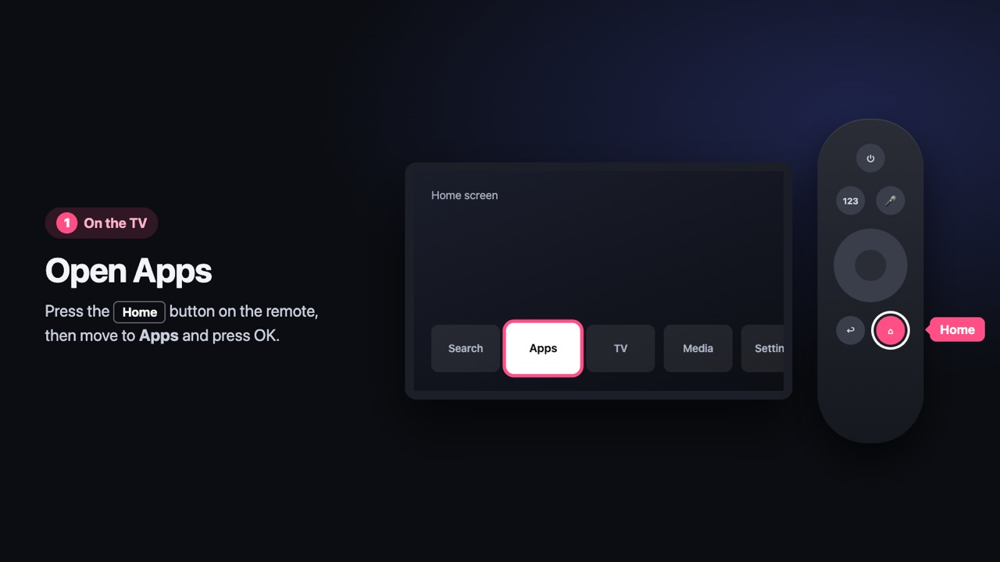

### 2. Open App Settings

Scroll all the way down in Apps and open **App Settings**.

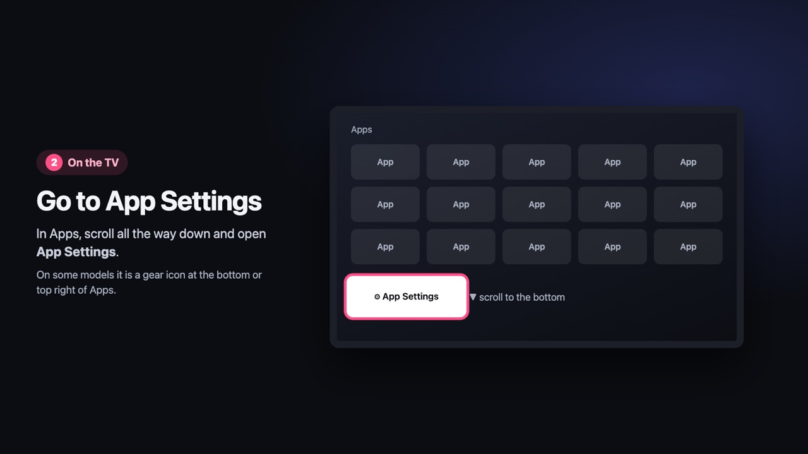

### 3. Type 1 2 3 4 5

A hidden Developer Mode window opens when you type **12345**. If your remote has no number keys, press **123** first to show a keypad on the screen.

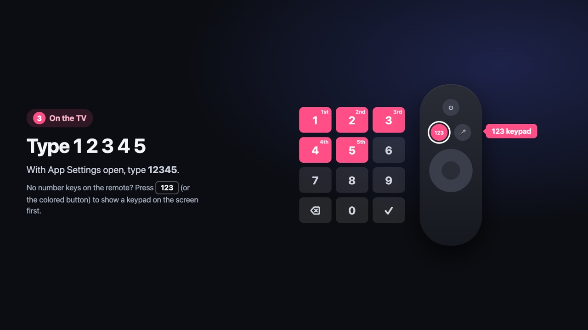

### 4. Turn on Developer Mode

Switch **Developer mode** to **On**, type your **computer's** IP address, and select **OK**.

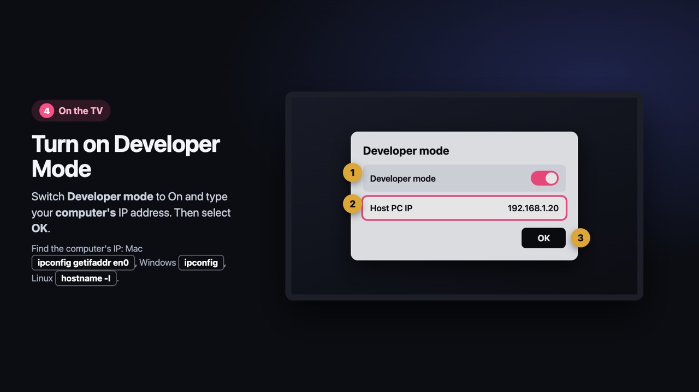

### 5. Restart the TV

Hold the power button until the TV turns off and back on.

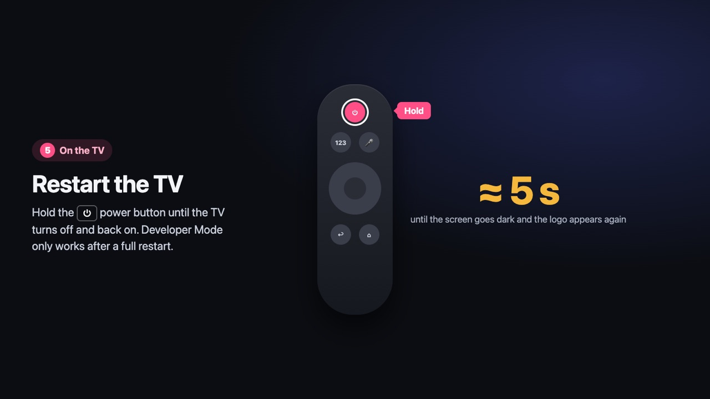

### 6. Write down the TV's IP address

Go to **Settings > General > Network > Network Status > IP Settings** and note the IP address. You need it in step 9.

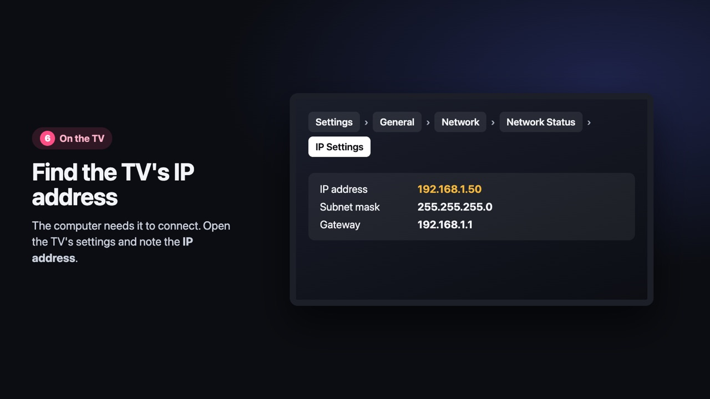

---

## Part 2: On the computer

You need [Node.js](https://nodejs.org) 22 or newer, [pnpm](https://pnpm.io/installation), a free [Cloudflare](https://dash.cloudflare.com/sign-up) account and [Tizen Studio](https://developer.tizen.org/development/tizen-studio/download).

### 7. Deploy your server

This small server plays the videos and handles logins. It runs free on your own Cloudflare account. After `kv namespace create`, paste the printed `id` into `worker/wrangler.jsonc`, then run `deploy`. Keep the address it prints at the end.

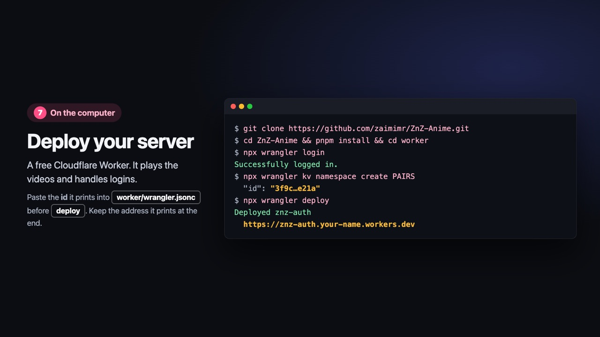

Want to log in with AniList or MyAnimeList? See the optional login steps in the [README](../README.md#2-set-up-your-server).

### 8. Make a Samsung certificate

In Tizen Studio's Package Manager, install **Samsung Certificate Extension**. Connect to the TV with `~/tizen-studio/tools/sdb connect <tv-ip>`, then open **Certificate Manager**. Click **+**, choose **Samsung**, then **TV**, name the profile **ZnZ**, and log in with a Samsung account.

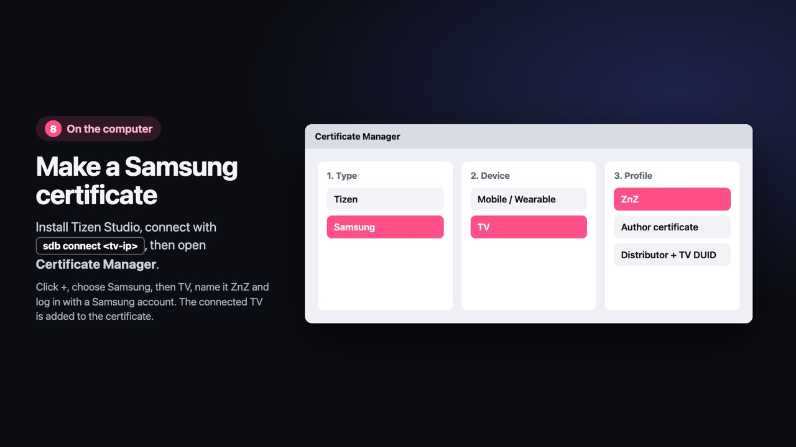

### 9. Sign and install

Download `ZnZAnime-<version>.zip` from the [latest release](https://github.com/zaimimr/ZnZ-Anime/releases/latest) and unzip it into a folder called `ZnZAnime`. Then sign it with your profile and send it to the TV.

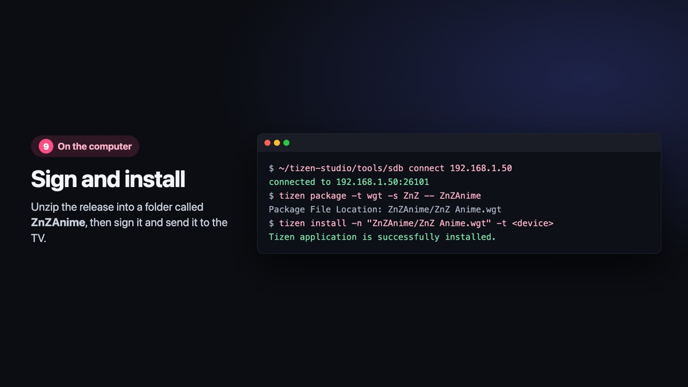

---

## Part 3: First start

### 10. Add your server

Open **ZnZ Anime** from Apps. Go to **Settings > Server**, type the address from step 7 without `https://`, and choose **Save**.

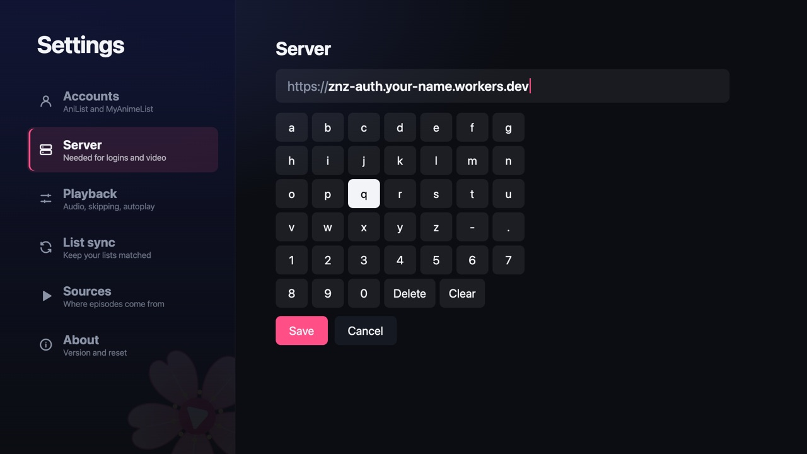

### 11. Pick how to keep your list

Choose **AniList**, **MyAnimeList**, or **No account** to keep the list on the TV only. You can change this later.

### 12. Log in with your phone

If you picked an account, scan the QR code with your phone, log in and allow access. The TV moves on by itself.

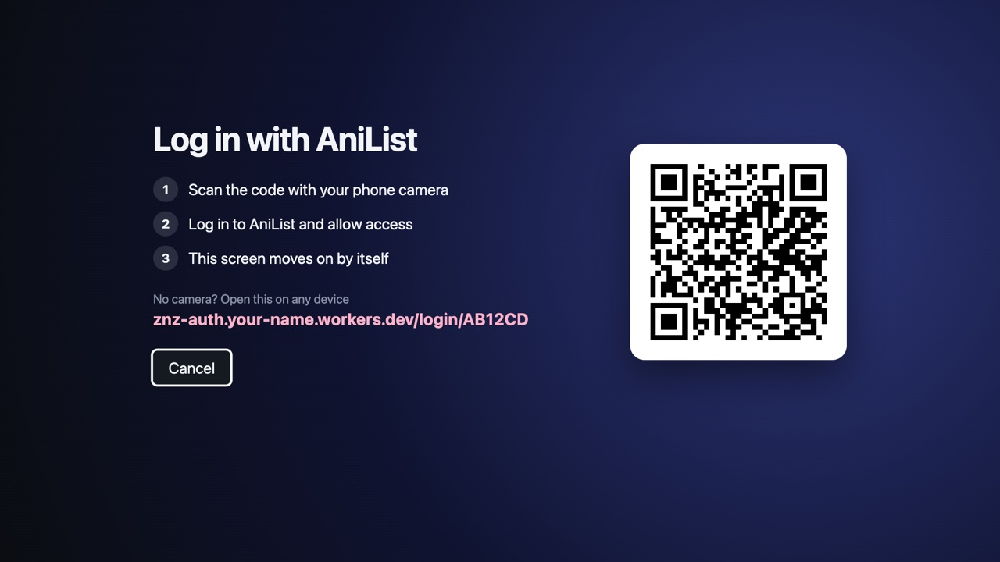

Done. Pick a show and press OK to play.

---

## If something goes wrong

- **The TV is not found when connecting:** check that Developer Mode is on with the right computer IP, restart the TV again, and run `sdb connect <tv-ip>` once more.
- **Certificate or signature error on install:** the TV was not connected when you made the certificate. Connect it, make a new certificate profile, and repeat step 9.
- **Videos say they need your server:** the server address is missing or wrong. Check it in **Settings > Server**.
